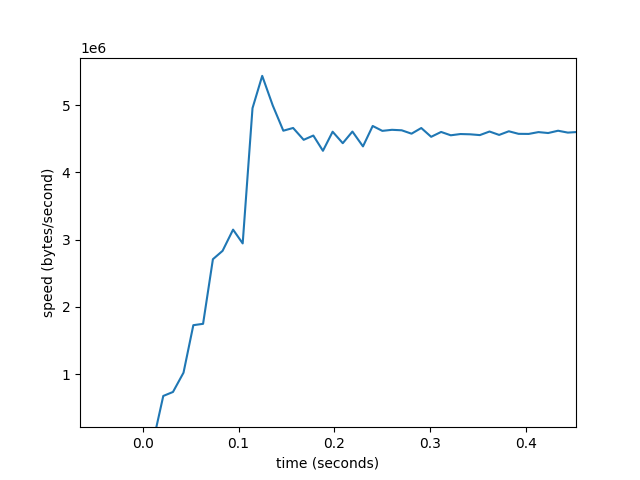

## Networks

### IP
IP is a simple protocol, it can send data between IP addresses.

### UDP
UDP is a simple extension of IP. Essentially it adds ports to IP.

### tcpdump

tcpdump is a packet analyzer.


Set up server
```shell
python tcp_server.py --port 8889
```

Analyze tcp packets on loopback interface on port 8889 (you can list interfaces with `ifconfig`) 
```shell
sudo tcpdump -i lo0 tcp port 8889
```

Send
```shell
python tcp_client.py test --port 8889
```

### TCP 

#### Opening connection
Famous (and somewhat confusingly named) three-way handshake is this:

Client generates its sequence number C. Send SYN packet to server with this number.
Server generates its own sequence number S. It responds with SYN with S and ACK for C + 1. 
It's a single packet SYN+ACK.
Client sends ACK for S + 1.
Handshake is complete and connection is ready to use.

ACK X means that sender received bytes `[0; X-1]` and expects byte #X.

Here's tcpdump of three-way handshake (S means SYN, `.` means ACK).
tcpdump results checks out with the theory
```text
02:57:20.040502 IP localhost.60472 > localhost.ddi-tcp-2: Flags [S], seq 3640016405, win 65535, options [mss 16344,nop,wscale 6,nop,nop,TS val 1826727395 ecr 0,sackOK,eol], length 0
02:57:20.040634 IP localhost.ddi-tcp-2 > localhost.60472: Flags [S.], seq 2752747578, ack 3640016406, win 65535, options [mss 16344,nop,wscale 6,nop,nop,TS val 1252349557 ecr 1826727395,sackOK,eol], length 0
02:57:20.040659 IP localhost.60472 > localhost.ddi-tcp-2: Flags [.], ack 1, win 6379, options [nop,nop,TS val 1826727395 ecr 1252349557], length 0
```

#### Closing connection
In theory connection is closed with four-way handshake.
Client sends FIN packet to server.
Server sends ACK for FIN.
Server sends FIN packet to client.
Client sends ACK for FIN.

In practice, it's possible to do it in a three-way handshake: FIN -> FIN-ACK -> ACK


#### Flow control & slow start
Receiver can tell sender to hold its horses with "receive window size" (rwnd).
Which is essentially: You can have at most `rwnd` of unacked data. 

The sender starts with a small congestion window (cwnd), which is essentially maximum number of unacked packets.
and gradually increases it as it receives ACKs from the
receiver. For each ACKed packet cwnd increases by 1. 
So we'll have exponential growth of cwnd (if every packet is ACKed, 
then for each X packets you'll increase cwnd by X and it'll be equal to 2X, then 4X, etc):
Obviously network has limited bandwidth, exponential growth is not sustainable, so eventually you'll
packet loss. Packet loss is used as feedback mechanism in TCP.
If you got packet loss, then another algorithm kicks-in, which on one hand doesn't want to be pessimistic and grow speed,
and on another hand it doesn't want to be to optimistic and overwhelm the network.

Since we have three-way handshake and slow start this means that:
* You pay a round-trip time for each new connection
* Speed at the beginning of your connection is not good.

That's why reusing TCP connections (keep-alive, http2) is important: 
since you pay the price of handshake and slow start only once for long standing connections.

Here's an example of slow start in action (notice that it takes some time to get to maximum speed):



Source code is [here](tcp_download.py)

#### Head-of-line blocking
Since TCP guarantees ordered delivery this means when packets A, B, C are sent and
packet A is lost, then application will need to wait until A gets delivered and will not see B and C
before that. That's head-of-line blocking. 


#### Fast retransmit
Let's say sender sends packets A, B, C, D, E.

Receiver gets A, acks it ACK(A + len(A))
Let's say B is lost.
C is received, but since it's out of order, we still send ACK(A + len(A))
D is received, it's also out of order, we send the same ACK.
E is received, same.

Now we get 3 duplicate ACKs.
Fast retransmit is triggered after 3 duplicate ACKS. 
In our case it resends packet B without waiting for retransmit timeout.


#### Nagle's algorithm
Let's say we have 3 small pieces of data: A, B, C.
We write A to a socket. This sends TCP packet with A.
We write B to a socket. With Nagle's algorithm we don't send it immediately, we wait for ACK of A.
We write C to a socket. With Nagle's algorithm we don't send it immediately, we wait for ACK of A.

We're getting ACK of A. Since B & C are small we send a single packet containing B+C.

Nagle's algorithm plays badly with delayed ACKS, you can disable it with TCP_NODELAY.
See source code in [tcp_nagle.py](./tcp_nagle.py)
Run it as:
````shell
nc -l 1234
````

Run with Nagle algorithm:
```shell
NGL_HOST=localhost NGL_PORT=1234 NGL_TCP_NODELAY=0 python tcp_nagle.py
```

Run without Nagle algorithm:
```shell
NGL_HOST=localhost NGL_PORT=1234 NGL_TCP_NODELAY=1 python tcp_nagle.py
```

You can see results with tcpdump:
```shell
sudo tcpdump -i lo0 tcp port 1234
```
We'll get only 2 PUSHes with Nagle. And 9 PUSHes without it.