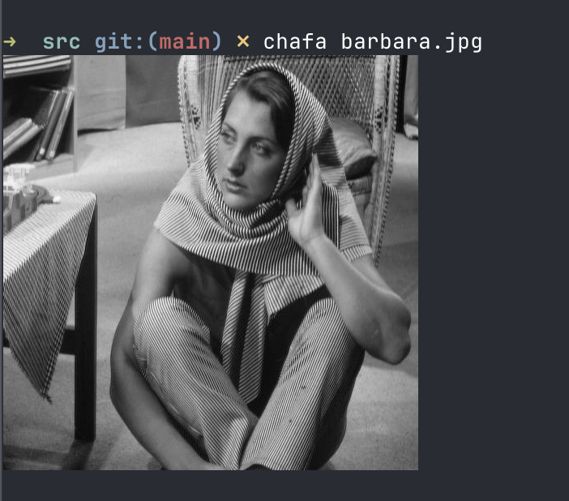

# Ghostty

## What is it?
Ghostty is a fast terminal emulator.


## Install
Download from https://ghostty.org/download


## Usage

### Quick terminal
Quick quake-style terminal (when it rolls down from above):

Ghostty -> Settings, then add `keybind = global:cmd+backquote=toggle_quick_terminal` to the settings file
and do Ghostty -> "Reload Configuration".

Now Cmd-` will open a persistent quick terminal. 

### Kitty
Ghostty supports kitty protocol and can e.g. render an image in the terminal, but you need some TUI to do that:

```shell
# chafa can render images
brew install chafa
chafa ../learning/opengl/src/barbara.jpg
# voila, you'll have an image rendered in a terminal!
```

Proof: 